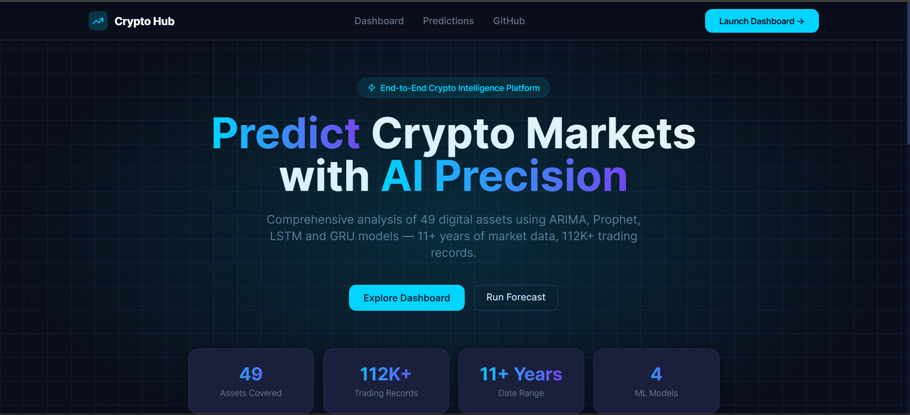

<div align="center">

# 🚀 Crypto Market Intelligence Hub

### *End-to-End AI-Powered Forecasting & Market Analysis*

[](https://python.org)
[](https://fastapi.tiangolo.com)
[](https://nextjs.org)
[](https://streamlit.io)
[](https://tensorflow.org)
[](https://docker.com)

<br/>

> **Volatility · Correlations · Regime Behavior · Multi-Model Price Forecasting**
>
> Comprehensive analysis of daily OHLCV data across **49 leading digital assets**
>
> 📅 **September 2014 → January 2026** &nbsp;·&nbsp; 📊 **112,000+ trading records** &nbsp;·&nbsp; 🤖 **4 ML Models**

<br/>



</div>

---

## 📋 Table of Contents

- [✨ Live Demo](#-live-demo)
- [📦 Project Architecture](#-project-architecture)
- [🗂️ Project Structure](#️-project-structure)
- [📑 Dataset Schema](#-dataset-schema)
- [🛠️ Tech Stack](#️-tech-stack)
- [🚀 Getting Started](#-getting-started)
- [🖥️ Application Screenshots](#️-application-screenshots)
- [📓 Notebook Walkthrough](#-notebook-walkthrough)
- [🤖 ML Models](#-ml-models)
- [💡 Key Findings](#-key-findings)
- [🪙 Assets Covered](#-assets-covered)
- [📂 API Reference](#-api-reference)
- [🐳 Docker Deployment](#-docker-deployment)
- [⚠️ Disclaimer](#️-disclaimer)

---

## ✨ Live Demo

| Service | URL | Description |
|---------|-----|-------------|
| 🌐 **Next.js Frontend** | [localhost:3000](http://localhost:3000) | Dark-themed fintech landing page |
| 📊 **Streamlit Dashboard** | [localhost:8501](http://localhost:8501) | Interactive analytics & forecasting |
| ⚡ **FastAPI Backend** | [localhost:8000/docs](http://localhost:8000/docs) | Swagger UI with all endpoints |

---

## 📦 Project Architecture

This project is a **production-grade, 3-tier ML system** built around a modular Python source tree, a REST API, two interactive UIs and a fully containerised deployment stack.

```
┌─────────────────────────────────────────────────────────────────┐
│                     PRESENTATION LAYER                          │
│   ┌──────────────────┐         ┌───────────────────────────┐   │
│   │   Next.js 14     │         │      Streamlit Dashboard  │   │
│   │  (Port 3000)     │         │         (Port 8501)       │   │
│   └────────┬─────────┘         └─────────────┬─────────────┘   │
└────────────┼─────────────────────────────────┼─────────────────┘
             │                                 │
┌────────────▼─────────────────────────────────▼─────────────────┐
│                       API LAYER                                 │
│              FastAPI + Uvicorn  (Port 8000)                     │
│     /health · /assets · /history/{asset} · /predict            │
└─────────────────────────────┬───────────────────────────────────┘
                              │
┌─────────────────────────────▼───────────────────────────────────┐
│                     DATA & MODEL LAYER                          │
│  ┌──────────┐  ┌──────────────┐  ┌───────────┐  ┌──────────┐  │
│  │ src/data │  │ src/features │  │src/models │  │ src/viz  │  │
│  │ load·    │  │ returns·     │  │ ARIMA·    │  │ charts   │  │
│  │ clean·   │  │ technical·   │  │ Prophet·  │  └──────────┘  │
│  │ store    │  │ pipeline     │  │ LSTM·GRU  │                 │
│  └──────────┘  └──────────────┘  └───────────┘                 │
└─────────────────────────────────────────────────────────────────┘
                              │
┌─────────────────────────────▼───────────────────────────────────┐
│                       STORAGE LAYER                             │
│     data/raw/*.csv  →  data/processed/*.parquet                 │
│              (49 assets · Parquet / PyArrow)                    │
└─────────────────────────────────────────────────────────────────┘
```

---

## 🗂️ Project Structure

```
Crypto-Market-Intelligence-Hub/
│
├── 📁 .github/workflows/
│   ├── ci.yml                    # Lint → Test → Coverage → Docker build
│   ├── data-pipeline.yml         # Daily 06:00 UTC yfinance refresh
│   └── deploy-vercel.yml         # Auto-deploy frontend on push to main
│
├── 📁 config/
│   ├── settings.py               # Pydantic BaseSettings (all env vars)
│   ├── logging.yaml              # Structured YAML logging config
│   └── model_params.yaml         # All model hyperparameters
│
├── 📁 data/
│   ├── raw/                      # 49 source CSV files (Yahoo Finance)
│   ├── processed/                # 49 Parquet files + all_assets.parquet
│   ├── external/                 # Third-party data sources
│   └── interim/                  # Mid-pipeline intermediate files
│
├── 📁 deployment/
│   ├── docker/Dockerfile.api     # Multi-stage FastAPI image
│   ├── docker/Dockerfile.dashboard # Streamlit image
│   └── vercel/vercel.json        # Vercel routing & security headers
│
├── 📁 docs/
│   ├── architecture.md           # System design documentation
│   ├── api_reference.md          # Full endpoint documentation
│   └── deployment.md             # Local, Docker & Vercel guides
│
├── 📁 frontend/                  # Next.js 14 + Tailwind CSS app
│   ├── app/                      # App Router pages
│   ├── components/               # Reusable UI components
│   ├── hooks/                    # useCryptoData, usePredictions
│   ├── lib/                      # API client & utilities
│   └── types/                    # TypeScript type definitions
│
├── 📁 images/
│   ├── screenshots/              # App UI screenshots
│   ├── charts/                   # Exported chart images
│   ├── architecture/             # System diagrams
│   └── logos/                    # Brand assets
│
├── 📁 notebooks/
│   ├── exploratory/              # EDA notebooks (Top_50_crypto.ipynb)
│   ├── experiments/              # Model experiment outputs & CSVs
│   └── reports/                  # 📄 crypto_market_intelligence_report.pdf
│
├── 📁 scripts/
│   ├── run_all.py                # Full pipeline: load → clean → features → store
│   └── generate_report.py        # Professional PDF report generator
│
├── 📁 src/
│   ├── data/                     # load.py · clean.py · fetch.py · store.py
│   ├── features/                 # returns.py · technical.py · pipeline.py
│   ├── models/                   # arima · prophet · lstm · gru · evaluate · registry
│   ├── api/                      # FastAPI main · schemas · routers
│   ├── dashboard/                # Streamlit app + 3 pages + components
│   ├── visualization/            # Plotly dark fintech charts
│   └── utils/                    # logger.py · helpers.py
│
├── 📁 tests/
│   ├── fixtures/conftest.py      # Shared synthetic OHLCV fixtures
│   ├── unit/                     # test_clean · test_features · test_evaluate · test_api
│   └── integration/              # test_pipeline.py (end-to-end)
│
├── docker-compose.yml            # api + dashboard + redis services
├── Makefile                      # 15+ dev targets
├── pyproject.toml                # Project metadata + tool config
├── requirements.txt              # Production dependencies
├── requirements-dev.txt          # Dev/test dependencies
└── .pre-commit-config.yaml       # Ruff · MyPy · standard hooks
```

---

## 📑 Dataset Schema

Each of the **49 CSV files** contains daily OHLCV data sourced from **Yahoo Finance** via `yfinance`:

| Column | Type | Description |
|--------|------|-------------|
| `Date` | `datetime64` | Trading date (UTC midnight) |
| `Open` | `float64` | Opening price (USD) |
| `High` | `float64` | Intraday high price (USD) |
| `Low` | `float64` | Intraday low price (USD) |
| `Close` | `float64` | **Primary target variable** (USD) |
| `Volume` | `float64` | Daily trading volume (base currency) |

**Engineered features added by the pipeline:**

| Feature | Description |
|---------|-------------|
| `log_return` | `ln(close_t / close_{t-1})` — stationary modelling target |
| `rolling_vol_30` | 30-day rolling std of log returns |
| `rolling_sharpe` | 30-day rolling Sharpe ratio × √252 |
| `drawdown` | `(close - rolling_max) / rolling_max` |
| `rsi` | RSI(14) — Relative Strength Index |
| `macd` / `macd_signal` | MACD(12,26,9) line and signal |
| `bb_upper` / `bb_lower` | Bollinger Bands (SMA20 ± 2σ) |
| `atr` | Average True Range (14-period EWM) |
| `obv` | On-Balance Volume (cumulative) |

---

## 🛠️ Tech Stack

| Layer | Technology | Purpose |
|-------|-----------|---------|
| **Data** | Python · yfinance · PyArrow | Ingest, clean, store as Parquet |
| **Features** | Pandas · NumPy · statsmodels | Return & technical indicator engineering |
| **Models** | statsmodels · Prophet · TensorFlow | ARIMA, Prophet, LSTM, GRU forecasting |
| **API** | FastAPI · Uvicorn · Pydantic v2 | REST endpoints with Swagger UI |
| **Dashboard** | Streamlit · Plotly | Interactive analytical dashboard |
| **Frontend** | Next.js 14 · Tailwind CSS · Recharts | Public-facing dark fintech web app |
| **Testing** | pytest · pytest-cov · httpx | Unit + integration tests with coverage |
| **CI/CD** | GitHub Actions | Lint → test → build → deploy |
| **Containers** | Docker · Docker Compose | Reproducible multi-service stack |
| **Deployment** | Vercel (frontend) · Any cloud (API) | Production hosting |

---

## 🚀 Getting Started

### Prerequisites
- Python 3.10+
- Node.js 18+
- Git

### 1 — Clone the Repository

```bash
git clone https://github.com/SajjadKhanYousafzai/Time-Series-Projects-Hub.git
cd Time-Series-Projects-Hub/Crypto-Market-Intelligence-Hub
```

### 2 — Install Python Dependencies

```bash
pip install -r requirements.txt
pip install -r requirements-dev.txt   # dev/test tools
```

### 3 — Run the Data Pipeline

```bash
python scripts/run_all.py
# Loads 49 CSVs → cleans → engineers features → saves Parquet files
```

### 4 — Start All Services

```bash
# FastAPI Backend (http://localhost:8000/docs)
python -m uvicorn src.api.main:app --reload

# Streamlit Dashboard (http://localhost:8501)
python -m streamlit run src/dashboard/app.py

# Next.js Frontend (http://localhost:3000)
cd frontend && npm install && npm run dev
```

### 5 — Run Tests

```bash
pytest tests/ -v --cov=src --cov-report=term-missing
```

### 6 — Generate PDF Report

```bash
python scripts/generate_report.py
# Output: notebooks/reports/crypto_market_intelligence_report.pdf
```

---

## 🖥️ Application Screenshots

### 🌐 Next.js Frontend

**Hero — Landing Page**


**Features Section**


**Key Market Insights**


---

### 📊 Streamlit Dashboard

**Home — Overview & Key Metrics**


**Technical Analysis — BTC Candlestick Chart**


**Price Forecasting — ARIMA · Prophet · LSTM · GRU**


---

## 📓 Notebook Walkthrough

The original exploratory notebook (`notebooks/exploratory/`) is organised into **3 parts** and **20 sections**:

### 🔧 Part 0 — Setup & Data Loading

| Section | Content |
|---------|---------|
| **1 — Setup** | Library installs, plot styles, random seeds |
| **2 — Data Loading** | Loads 49 CSVs → long-format DataFrame → feature engineering |
| **3 — Data Quality** | Coverage bar chart, missing value analysis, anomaly detection |

### 📊 Part 1 — Exploratory Data Analysis

| # | Sub-section | Key Visualisations |
|---|-------------|-------------------|
| 4 | **Market Overview** | Price tier pie chart, top-20 price bar, log-price histogram |
| 5 | **Price Trends** | Historical close + ATH markers for 8 assets (fill-between) |
| 6 | **Returns Analysis** | Log-return distribution, box plots, BTC vs ETH cumulative return, kurtosis ranking, monthly heatmap |
| 7 | **Volatility Regimes** | Market-wide rolling vol timeline, asset vol ranking, ARCH ACF |
| 8 | **Correlation Analysis** | Hierarchically clustered heatmap, 90-day rolling BTC correlation |
| 9 | **Volume Analysis** | Top volume assets, price-volume dual axis, monthly seasonal volume |
| 10 | **Performance Metrics** | Total return, max drawdown, risk-return scatter (Sharpe-coloured) |
| 11 | **Seasonality** | BTC drawdown timeline, monthly pooled returns, YoY BTC returns |

### 📉 Part 2 — Time Series Analysis

| Section | Content |
|---------|---------|
| **12 — Stationarity** | ADF + KPSS tests on prices vs log returns · seasonal decomposition |
| **13 — ACF / PACF** | Volatility clustering evidence · train/test split setup |

### 🤖 Part 3 — Forecasting Models

| Section | Model | Key Outputs |
|---------|-------|-------------|
| **14** | ARIMA | AIC grid search · 30-day forecast plots with train/test marker |
| **15** | Prophet | Multiplicative seasonality · 80% CI bands · component decomposition |
| **16** | LSTM | 2-layer stacked LSTM · EarlyStopping · training loss curves |
| **17** | GRU | Identical to LSTM with GRU cells · ~30% faster training |

### 📈 Part 4 — Evaluation & Predictions

| Section | Content |
|---------|---------|
| **18 — Model Comparison** | Grouped MAE/RMSE/MAPE bars · best model per asset table |
| **19 — 30-Day Forecasts** | Prophet refitted on full dataset · forecast + 80% CI shaded band |
| **20 — Summary** | Full dataset statistics · model performance averages · 10 key observations |

---

## 🤖 ML Models

| Model | Type | Strengths | Best For |
|-------|------|-----------|---------|
| **ARIMA** | Classical statistical | Fast, interpretable, AIC-optimal | Short horizons, linear trends |
| **Prophet** | Bayesian decomposition | Seasonality detection, changepoint detection, calibrated CIs | Trend analysis, seasonal decomposition |
| **LSTM** | Deep learning (RNN) | Non-linear patterns, long-range dependencies | Best RMSE on BTC/ETH |
| **GRU** | Deep learning (RNN) | ~30% fewer params than LSTM, comparable accuracy | Compute-constrained environments |

**Evaluation Metrics:** `MAE` · `RMSE` · `MAPE` · `R²`

**Train/Test Split:** 80% chronological training / 20% hold-out test (no shuffling — preserves temporal order)

---

## 💡 Key Findings

> *From 11+ years of data across 49 assets:*

1. 🔗 **High-Correlation Universe** — Average cross-asset correlation ≈ 0.7. Most assets rise and fall together; diversification within crypto is structurally limited.

2. 📉 **Volatility Clustering (ARCH Effects)** — Strong ACF in squared returns confirms volatility clusters. Bitcoin is the *least volatile* major asset, acting as the market's vol anchor.

3. 📊 **Fat-Tailed Returns** — Pooled kurtosis >> 3. Daily moves of ±15% are far more frequent than Gaussian models predict — standard risk frameworks underestimate tail risk.

4. 📅 **Seasonal Patterns** — Q4 (Oct–Dec) is historically Bitcoin's strongest quarter (*Uptober*). June–September is consistently the weakest period.

5. 💥 **Boom-Bust Cycles** — Despite 100x+ all-time returns, BTC suffered >80% drawdowns in each market cycle. Timing and risk management are critical.

6. 📈 **Non-Stationarity** — Raw price series have unit roots (ADF fails). Log returns are weakly stationary and the correct modelling target.

7. 🏆 **Best Risk-Adjusted Asset** — **Kaspa** (Sharpe 1.10), **Solana** (0.71), **Bitcoin** (0.70). 26 of 49 assets have negative Sharpe ratios over the full period.

8. 🤖 **Best Model (RMSE)** — LSTM/GRU achieve lowest RMSE on BTC and ETH. Prophet excels at trend decomposition. No single model dominates across all assets.

9. ⚡ **GRU vs LSTM** — GRU trains ~30% faster with comparable accuracy; preferred when compute is constrained.

10. 🎯 **No Universal Winner** — Asset, horizon and data length all affect model choice. An ensemble of ARIMA + Prophet + LSTM typically outperforms any single model.

---

## 🪙 Assets Covered (49 total)

| Category | Assets |
|----------|--------|
| 🟠 **Store of Value** | Bitcoin · Litecoin |
| 🔷 **Smart Contract** | Ethereum · Solana · Cardano · Avalanche · Polkadot · Near · Cosmos · Internet Computer · Tezos · Flow |
| 🔶 **Exchange Tokens** | Binance Coin |
| 🦄 **DeFi** | Uniswap · Aave · Maker · Chainlink · The Graph · Lido |
| ⚡ **Layer 2** | Polygon · Arbitrum · Optimism · Immutable |
| 🐕 **Meme Coins** | Dogecoin · Shiba Inu · Pepe |
| 💵 **Stablecoins** | Tether (USDT) · USD Coin (USDC) |
| 🚀 **Emerging** | Kaspa · Sui · Aptos · Render · Stacks · Injective · Toncoin |
| 🌐 **Other** | XRP · Tron · Stellar · EOS · VeChain · Theta · Hedera · Filecoin · Fantom · Decentraland · Sandbox · Axie Infinity |

---

## 📂 API Reference

The **FastAPI** backend runs at `http://localhost:8000`. Interactive docs at `/docs`.

| Method | Endpoint | Description |
|--------|----------|-------------|
| `GET` | `/health` | Health check & uptime |
| `GET` | `/api/v1/assets` | List all available assets |
| `GET` | `/api/v1/history/{asset}` | OHLCV history for an asset |
| `POST` | `/api/v1/predict` | Run a model forecast |
| `GET` | `/api/v1/metrics/{asset}` | Risk/return metrics summary |

Full documentation: [`docs/api_reference.md`](docs/api_reference.md)

---

## 🐳 Docker Deployment

Run the full stack with a single command:

```bash
# Start all services (API + Dashboard + Redis)
docker compose up --build

# Services:
# FastAPI    → http://localhost:8000
# Streamlit  → http://localhost:8501
# Redis      → localhost:6379
```

Environment variables: copy `.env.example` → `.env` and fill in your values.

Full guide: [`docs/deployment.md`](docs/deployment.md)

---

## 📜 Data Source & License

- **Source:** Yahoo Finance via `yfinance` library
- **Dataset:** [Kaggle — Top 50 Cryptocurrency Dataset](https://www.kaggle.com/datasets/dhrubangtalukdar/top-50-cryptocurrency-dataset)
- **License:** Educational and research use only
- **Report:** See [`notebooks/reports/crypto_market_intelligence_report.pdf`](notebooks/reports/crypto_market_intelligence_report.pdf) for the full 14-chapter professional analysis

---

## ⚠️ Disclaimer

All forecasts and analysis in this project are **for educational and research purposes only**. Cryptocurrency markets are highly volatile and unpredictable. Nothing here constitutes financial advice. Past performance does not guarantee future results. Never invest more than you can afford to lose.

---

<div align="center">

**Built with ❤️ by [Sajjad Khan Yousafzai](https://github.com/SajjadKhanYousafzai)**

*Crypto Market Intelligence Hub · Data: Yahoo Finance · Sep 2014 → Jan 2026*

[](https://github.com/SajjadKhanYousafzai/Time-Series-Projects-Hub)

</div>
